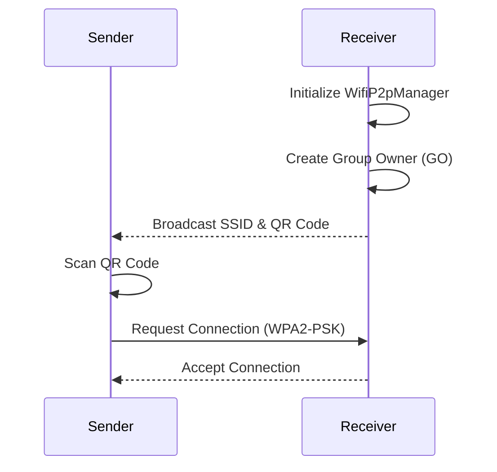
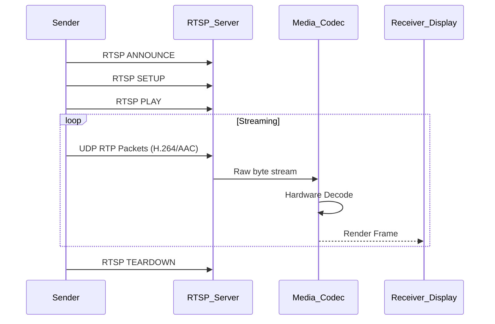

# Data and Control Flow

## 1. Connection Establishment Flow

## 2. Media Streaming Flow

## 3. State Management
The UI state is managed via React hooks (`useState`, `useEffect`). Global configurations like Language, Theme, and Hotspot sync are maintained in a structured `AppConfig` object.
