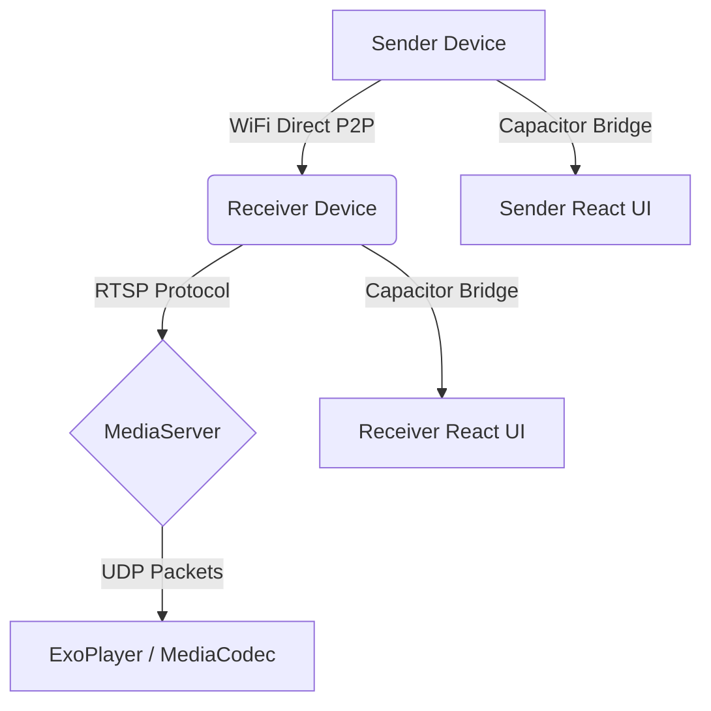

# System Architecture

## 1. Introduction
The Smart View ecosystem enables wireless screen mirroring with ultra-low latency. It utilizes a hybrid architecture combining a web-based React frontend for the UI and native Android capabilities exposed via Capacitor.

## 2. Component Diagram

## 3. High-Level Components
### 3.1. Frontend UI (React + Tailwind)
Manages the application state, user configurations, and handles the QR code scanning logic. It acts as the orchestration layer.

### 3.2. Native Bridge (Capacitor)
Interfaces between the WebView and Native Android APIs for Network Management (WiFi Direct) and hardware acceleration.

### 3.3. P2P Network Manager
Handles Android `WifiP2pManager`, establishing the Group Owner (GO) and negotiating WPA2-PSK connections securely.

### 3.4. Media Pipeline
A custom lightweight RTSP server handling `ANNOUNCE`, `SETUP`, `PLAY`, and `TEARDOWN` states, decoding streams via Android's hardware `MediaCodec`.

## 4. Scalability and Limitations
- **Current Scope:** Operates strictly on local subnets via WiFi Direct.
- **Latency:** Target is <100ms.
- **Resolution:** Supports up to 1080p at 60fps depending on network conditions.
